# 复现论文Revisiting Multiple Instance Neural Networks
## 1.文件说明
“train_mi.py”文件是mi-Net模型

“MI_net.py”文件是MI-net模型

“MI_net_DS.py”文件是 MI-net with deep supervision模型

"MI_Res.py"文件是MI-net with Res 模型

"loader.py"文件是针对MUSK1/2数据集的导入方法

"pre_.py"文件是针对fox/elephant/tiger数据集的导入方法，导入数据集的同时对数据集的顺序进行了打乱，由于没有找到文中的第三个数据集，故第三个数据集的导入函数尚未编写

"mi_MUSK1.py"文件是训练、测试文件，可以通过修改注释改变导入的数据集和模型

## 2.环境
实验均在manjaro系统下，使用anaconda建立虚拟环境，使用CPU版本的pytorch进行实验，python版本为3.7.11
## 3.训练过程
由于没有发现论文中对数据集进行训练集、测试集的具体划分，于是对每一个数据集进行7/3分，即70%的数据作为训练集，剩余的30%作为测试集。

由于数据集都比较小，所以训练次数可以适当增加，对每一个训练集都做1000次训练，每进行100次训练就在测试集上测试结果

## 4.实验结果
### a. mi-net网络
在MUSK数据集上的 表现十分不稳定，在60%-96%之间跳动，有时会升高到100%

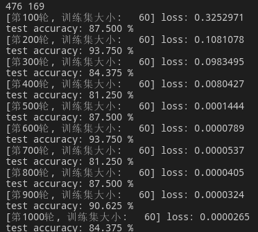
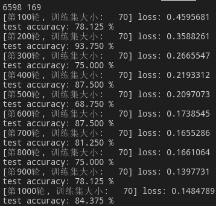

比较奇怪的是，在fox等图像数据集上的表现非常好

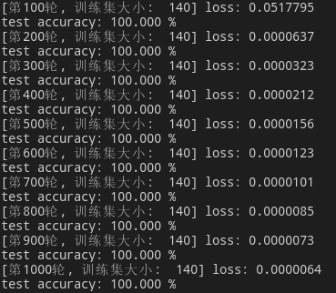
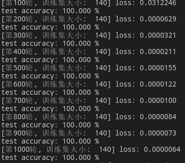
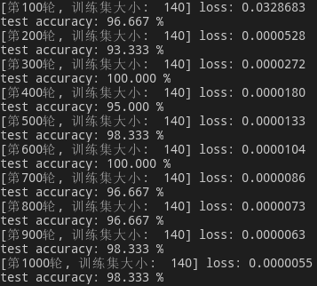

### b.MI-net网络
与mi-net类似，在MUSK数据集的表现十分不稳定

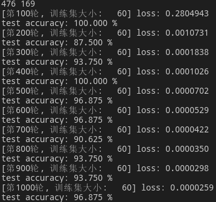
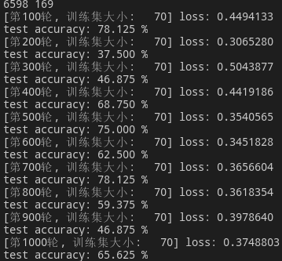

在fox等image数据集的表现

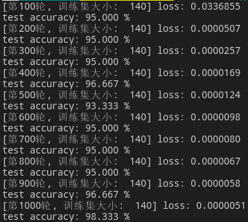

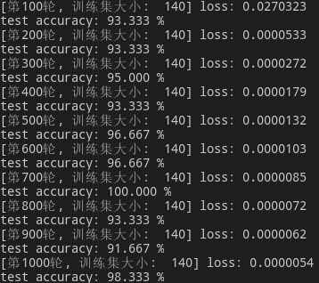

### c.MI-net_DS网络

在MUSK数据集上的表现明显好于前两个网络

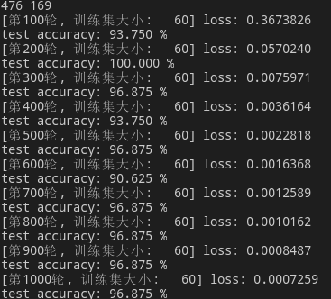
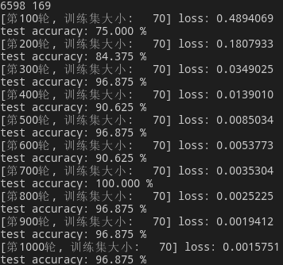

fox等image数据集上的表现，相比前面的网络哦反而下降了

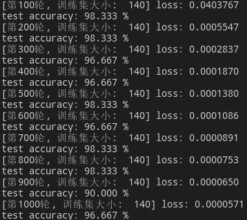
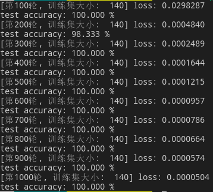
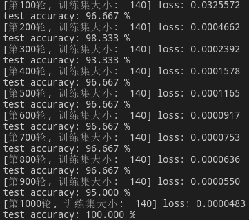

### d.MI-net_Res网络

在musk数据集上

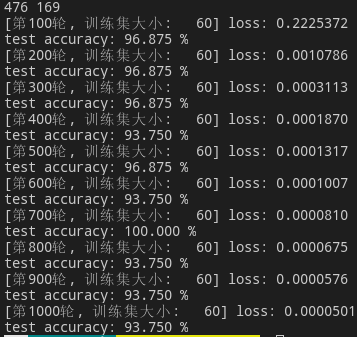
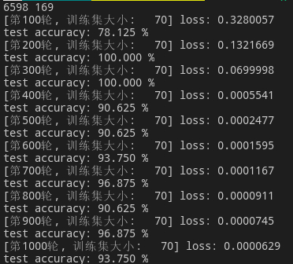

在fox等image数据集

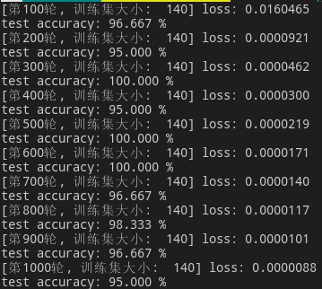
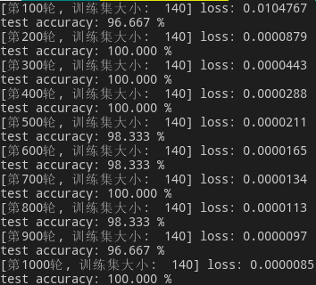

### e.关于池化函数

以上结果均在max池化函数下进行，均值函数在某些数据集有更好的表现，例如MI-net_Res网络训练tiger数据集时。

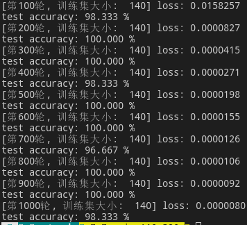

而在musk2数据集上的表现就明显不如max函数

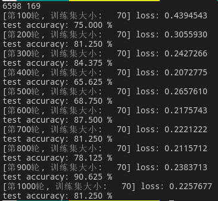
